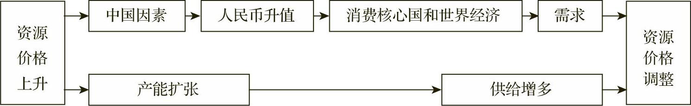
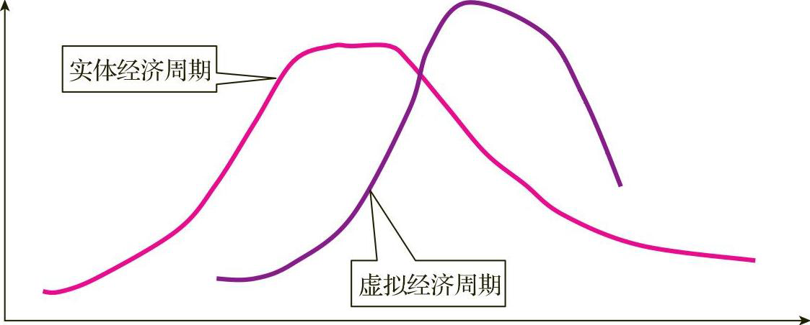
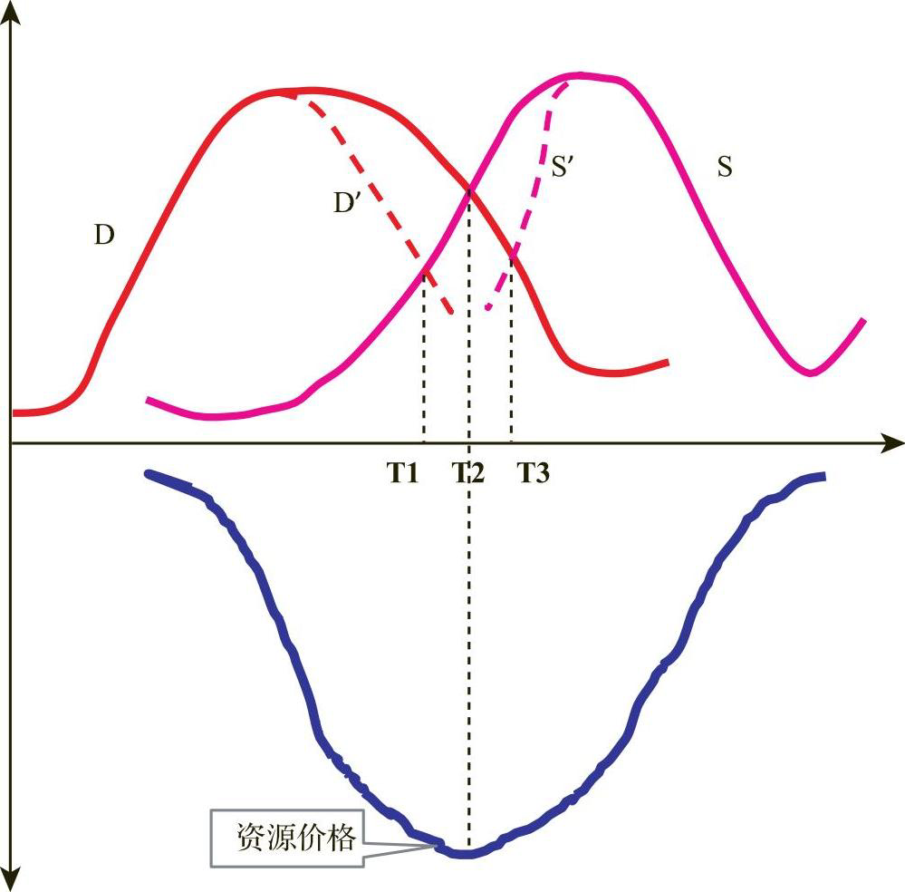
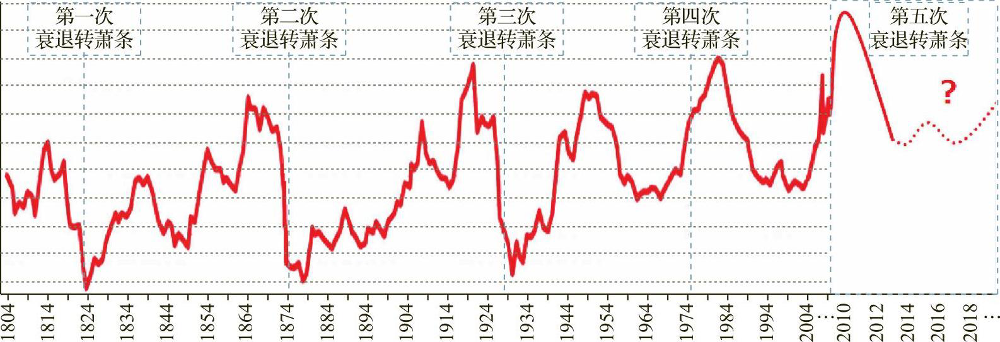
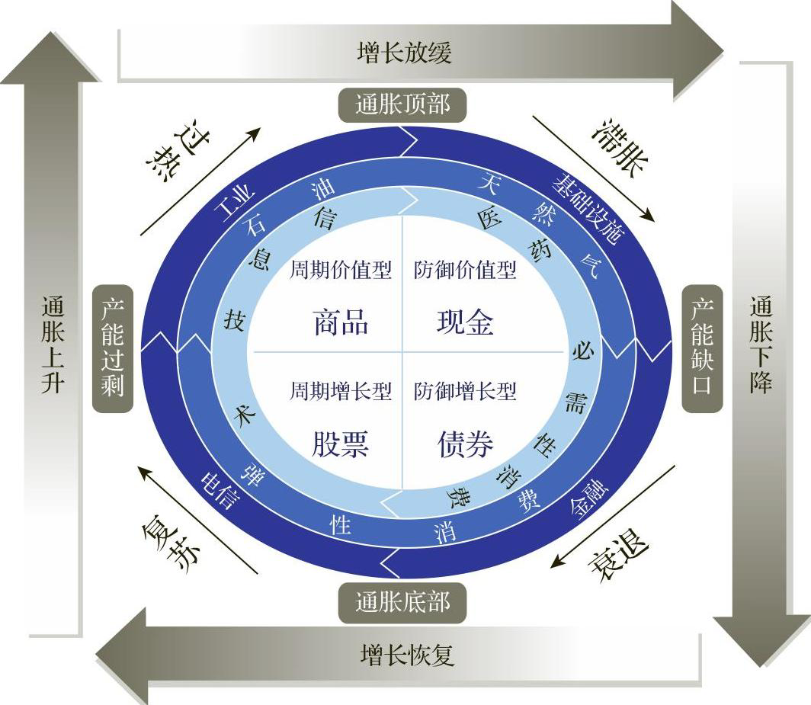
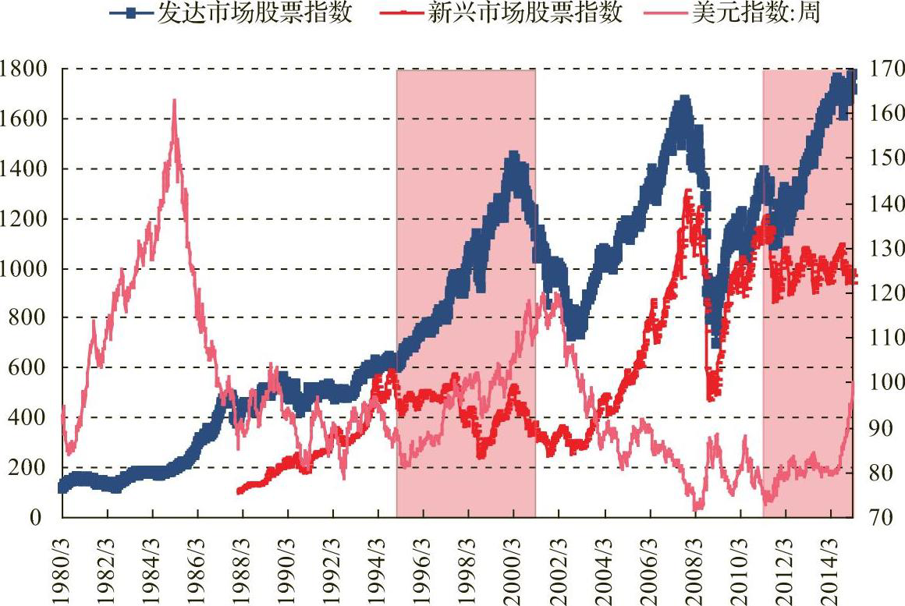
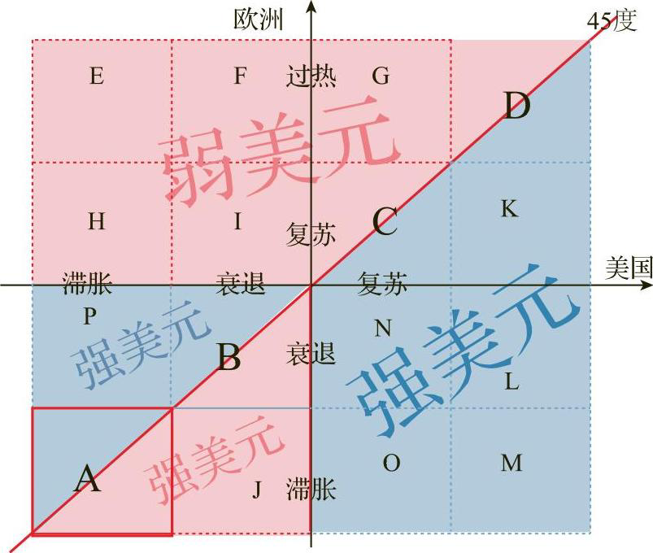
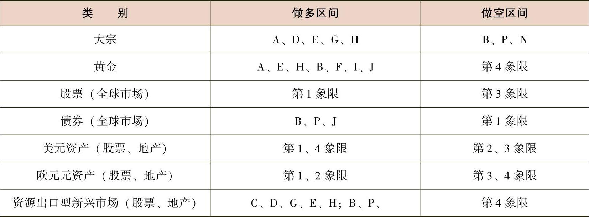

# 涛动周期论：经济周期决定人生财富命运

| 状态 | 已归档   |
| -- | ----- |
| 分类 | 经济,金融 |
| 作者 | 周金涛   |

- 2016 年演讲：人牛就是一场康波
  - 大家发现今年放水不管用了，这就是资产价格的转换点。我看去年大家讨论资产荒……这是很危险的信号，这是一个转折点。
  - 一个技术当它在追赶国的渗透程度达到了无孔不入的时候，一定达到了它生命周期的最后阶段，这个技术后面就是一个成熟并衰落的趋势。
  - 中国的一个库存循环是这样的，从买进东西到厂家生产是六个月，重复两到三次是一年半，再有一个下跌周期，所以一个循环是三年的库存周期。
  - 一旦看到 PPI、CPI 转头，甚至涨不动，这时候要小心，这可能是经济的第三库存周期高点，这个高点出现要抛掉所有的资产，只留现金和黄金等待低点的出现。
  - 当你预感人民币要贬值的时候，可以做空韩元，韩国是中国经济的领先指标；还可以随后做空澳元，澳大利亚是资源国，它的货币是跟着铁矿石波动的。
- 2006 年演讲：繁荣的起点 —— 中国股市大繁荣时代来临
  - 本轮中周期固定资产投资增长率的高点可能是以后无法逾越的历史高点，中国高增长的转型期已经开始。
  - 世界经济史表明，每次新经济体的崛起时期，国际分工体系的改变往往会引起国际经济的失衡，在实体经济的调整难以短期实现的情况下，金融市场将担当全球经济失衡压力释放的渠道，此时的货币政策无论对实体经济还是虚拟经济来说，都是既重要又关键。
  - 从主要工业化国家的股市发展史来看，一国进入工业化中期以后，虚拟经济都会有一次超越周期的大繁荣出现。
  - 虽然经济的转型期本质上就是经济衰退，这将大大抑制股市的繁荣程度，但作为中国虚拟经济繁荣的起点，我们认为市场的活跃是可以期待的。
  - 经济转型过程中，中小企业将肩负起维持经济增长的重任，中村秀一郎教授更是将中小企业逐步发展成为「中坚企业」的过程看作是「真正的工业社会即群众社会化现象的集中表现」。
- 2016 年：「色即是空」——世界经济的共生模式
  - 资源约束是一种典型的经济增长约束形式，而且，往往作为金融约束和需求约束的触发因素，共同引起经济增长周期性波动。
  - 资源品价格的周期受制于世界经济增长的周期，随着世界经济增长周期的繁荣而繁荣、衰退而衰退。
  - 世界经济长周期的衰退导致了大宗资源品供给能力的持续衰弱，而中周期的强劲反弹引起了资源品需求的迅速增加，从而供需矛盾出现极度冲突并造成资源价格大牛市。
  - 中国资源行业和非资源行业一定出现了严重的价格和利润分化，即通过牺牲工业利润维持了世界的低通胀，进而延长了整体世界经济增长周期，以及国际资源价格的上涨趋势。
  - 世界经济共生模式与传统模式相比，一个重要的变化是生产与消费出现分离，即，生产、消费是由于不同决策环境下的行为主体分别决定的。
  - 物价上升并不是唯一的传导利润的形式，在共生模式中，汇率是调节国际产业利润和经济增长的重要形式，从而成为影响资源价格波动的重要内生调节机制之一。
  
  - 人民币升值可能是共生模式下资源价格内生调整机制的必然。
  - 美元的国际地位是共生模式的基础，但共生模式是建立在经济和金融失衡基础上的，突出体现为美国贸易赤字的极度扩张，从长期看，这必将大肆透支美元信用。
  - 在美元作为失衡的共生体系的前提下，美元贬值导致的经济衰退作用可能要远大于美元标价作用对国际资源价格的影响。我们预计，2016 年后半年，当美国持续加息的可能性越来越小的时候，世界经济增长的风险性可能会更加明晰。
  - 当实体经济出现动态失效时，虚拟经济领域便会出现持续的投机泡沫，会有更多的资金被投资于虚拟资产而不是实体经济……这一过程体现为虚拟经济周期对实体经济周期的滞后性，从资源品价格和世界经济走势上看，的确也验证了这一点。
  
  - 资源品供需都呈周期性变化，但供给周期落后于需求周期，因此，当实体经济回落时，资源品的供缺口仍然存在，资源品价格尚不能立刻从供给短缺中解放出来，从而呈现出虚拟经济繁荣的滞后效应。
  
- 2016 年：长波衰退中的增长与通胀
  - 美元本位由于缺乏金本位下，通过黄金流动来抑制贸易不平衡约束机制，所以美国的赤字政策和美元储备的膨胀，本质上决定了世界经济中会存在被放大的需求和由信用所催生的产能过剩，这些问题在当前并不明显。所以，我们必须重新思考当前旺盛的经济需求中，有多大的美元信用膨胀因素。
  - 资源约束与产能过剩，这是长波衰退的两个基本原因，但在美元本位的货币体系下，资源约束更多地向通货膨胀和资产泡沫化演化，这也是在世界经济进入美元体系之后，通货膨胀治理艰难，同时资产泡沫频发的原因。
  - 结合科技网络股泡沫以及美国经济历次波动对于世界经济的影响，我们可以发现，目前美国经济以及世界经济的这种调整过程，整体可以划分为三个阶段：
    - 第一阶段，美联储放松货币政策以延缓经济增长步入衰退的速度。在这一阶段之内美元将会呈现加速贬值的态势。
    - 第二阶段，伴随着美元的持续性贬值，位于全球一体化中的其他国家也会受到影响。
    - 第三阶段，受制于欧元区以及其他发达国家经济增长渐缓，并同美国经济一致性回落，依赖于净出口拉动经济的发展中国家开始呈现景气回落迹象。
- 2008 年：走向成熟 —— 中国经济即将 V 形反转
  - 大型化和升级无疑将是起飞阶段过后的基本增长模式。
  - 从起飞的本质是以固定资产投资所推动的主导产业的高速增长特征来看，投资的拉动遭遇到资源或者市场的制约之后，必然产生经济萧条，这就是我们所说的起飞结束的基本特征。
  - 事实上，起飞的本质就是要求保证财富向少数人手中集中以完成原始积累的过程和进行再投资。所以，起飞之后，社会的贫富分化将呈现加速的趋势。
  - 成熟阶段并非是一个工业化的结束期，而是一个工业化的扩散器。在这个阶段，投资拉动经济的增长模式依然持续，但是投资可能会在一个区间窄幅波动。而城市化依然处于加速期，只不过具体结构发生了变化，所以，这也是我们在前面论述中强调，起飞结束的萧条是一个能够迅速恢复的萧条，根本原因就是原动力依然存在。
  - 区域的扩散是走向成熟的一个重要经济特点。这一点也是与城市化扩散相伴随的。
  - 大规模的合并对确立日本经济在国际上的竞争力起到了重要作用。
- 2010 年：结构主义的薪火——周期波动、结构演进与制度变革
  - 在长波衰退之后的这个历史阶段，实体经济无法继续吸收流动性，也就是说，微观主体已经无法对货币的宽松和持续宽松做出理性的反应，因为这个阶段，不断下滑的总需求制约了微观主体的行为，他们更加注重经基本面和未来的预期，而对流动性宽松程度的反应已经是事实上下降。
  - 未来的机会更多将存在于结构变动中，而不是总量的变化中，这是一个投资逻辑的改变。
  - 进入走向成熟之后，增长问题的重要性降低，而全社会由于劳动力等生产要素的变化，开始进入一个更加关注财富分配的阶段，这是工业化自身的宿命，是起飞期财富集中的结果。
  - 朱格拉在 1862 年提出，资本主义经济存在一个大致 9～10 年左右的周期波动，中周期实际上最为典型的是资本支出的周期性变化，有时也被称为资本支出周期。
  - 虽然我们曾经多次在恰当的时候预测了顶部，但预测底部却是一个十分困难的问题。经济周期的顶部、底部机制是不同的，顶部从来都是一个系统性问题，因此易于预测。但底部从来都不可能是一个系统问题。因为在二次去库存之后的经济向中周期过度的过程中，真实需求来源于微观企业的个体行为，来源于微观为提升效率而进行的努力，不是一个宏观问题。
  - 在前十年，政策之手总是期望摁住市场，而在未来，政策之手不得不游离于保持增长与防止通胀恶化之间，所以，这是一个典型的结构增长的时代。
- 2010 年：三周期嵌套——从熊彼特到罗斯托
  - 熊彼特将「创新」一词定义为「新的生产函数的建立」，即「企业家对生产要素的新的组合」。
  - 罗斯托指出：主导产业是那些具有足够创新的产业，是那些经济增长过程中起到主导和引领作用的产业，是那些对整个产业链起到重要影响的、具有强大扩散效应的产业。
- 2011 年底：康波衰退第二次冲击正在靠近
  - 美元的确定升值周期一定会对附属国经济产生影响，康波衰退一定以一个强势美元结束。
  - 房地产周期调整时的大类资产配置体现出「股熊债牛」的特征，这是我们系统研究的的结论（《地产周期大拐点之后的投资策略》）。
  - 在房地产周期调整的大背景下，股市不会出现牛市，我们发现随着中国房地产投资属性的下降，资金配置向资本市场的转移是一种短期的推动力量，但从中期来看，这是从一种毁灭走向另一种毁灭，现在对资本市场的过度乐观一定会在三年内的某一时间点付出代价。
- 2014 年：人牛发财靠康波——康波中的价格波动
  - 康波的根本问题还是世界资源品价格的长期波动问题，资源品价格又包括商品属性和金融属性两个方面。而这一点也决定了康波就是国际宏观对冲的根本原理。
  - 增长与通胀的关系是划定康波阶段的核心问题。
    - 在康波的繁荣阶段，往往是高速增长与低通胀伴随，这可以解释为新的技术提高了效率，高增长并没有引发资源约束。
    - 在每一个康波的衰退阶段，衰退的前半期都是高增长引发的高通胀，而后半期都是滞涨，从衰退期到萧条期总是如此反复。
    - 康波从萧条向回升的转换本质上就是从滞涨向通缩的转换，此时经济增速不断下移，商品价格明显回落，通缩成为社会的共识。
    - 但是从以往的康波形态来看，衰退期和萧条期都表现出极其复杂的状态，特别是进入美元本位制后，货币对康波形态的扰动明显增加。
  - 长鞭效应其基本含义是：当供应链上的各节点企业之根据来自相邻的下级企业的需求信息进行生产或者供应决策时，需求信息的不真实性会沿着供应链逆流而上，产生逐级放大的现象。
  - 我们需要理解为什么在经济衰退之后依然出现一定时期的能源价格上涨呢，这个就存在着能源消费的惯性规律问题。对此，木船久雄解释道「日本在石油危机之后，尽管能源价格发生了变化，但是，战后近 30 年配置起来的多能耗产业和消费结构也难以因价格变化而极速转换……所以我们一直认为，康波资源牛市是一个累积的结果，当期供需并不是一个核心原因。
  - 历史上黄金价格与美国 CPI 的定基指数的比率为 3.2 倍，这可以视为是黄金购买力的均值。
  - 衰退和萧条的连接点一定是一个康波大宗商品价格的最低点，这一点为千五波康波的价格形态所证明。
  
- 2015 年：改造「美林投资时钟」——全球大类资产配置框架研究
  - 同一类资产在同一个全球周期中因为汇率问题（因为国别之间的周期不同步问题），而出现如此巨大的收益分化，显然是美林投资时钟所无法解释的。而对于全球投资配置来讲，美林投资时钟就成了一块中看不中用的废表，毫无指导意义。
  
  - 美元的强势期一般都是国际经济的相对疲弱期，尤其是作为大宗商品主要需求对象的工业生产国往往也处于不太景气的态势。
  - 在美元的相对弱势期新兴市场与发达市场股市与债市牛熊格局趋同，而在美元的强势阶段，新兴市场与发达市场股市与债市均表现出了显著的牛熊背离格局。
  
  - 1995 年之后，美国的中周期进入强势阶段，而彼时是美国房地产周期的强势阶段。
  - 欧美坐标系下的全球宏观对冲框架
  

  
- 2012 年：美元破百（跌破），冲击中国
  - 利用早周期行业判读周期运行的方法，低点看汽车，高点看纺织。纺织行业、汽车行业产能利用率从 2011 年 3 月份出现显著下滑，这标志着短期去库存进入了加速阶段。
- 2015 年：康波体系下的黄金价格
  - 黄金的实际持有收益率在康波的衰退和萧条期趋于上行，在萧条期达到高点，而在复苏和繁荣期则趋于下降。如果长波周期从复苏到萧条的运行代表着经济增长的轨迹，那么黄金价格的走势则可以看作经济增长的反面。
  - 站在长周期的视角来看，金价跟随全球经济长波周期和货币体系的演进所呈现的波动规律对应着其根本属性——信用对冲，这一属性表现为金价的长期波动与实体信用和货币信用反相关。
  - 我们在《美元破败，冲击中国》中曾经讲过，长波繁荣前期主导国货币将处于强势货币地位，这也成为实际金价在长波复苏和繁荣阶段的抑制因素。
  - 除去美国在金融危机期间的降息导致的背离，金价与欧美主权债务利差走势在大部分时间里高度一致。
- 周金涛演讲实录：宿命与反抗——2016 年全球大类资产配置
  - 美国的库存周期跟中国的有些不一样，美国是一个消费为主的国家，所以美国的库存周期一定要见到零售库存见顶，制造业库存见底，然后才能开启。
