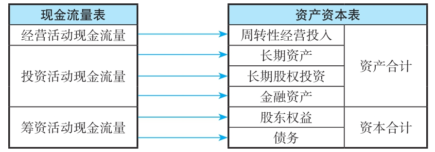
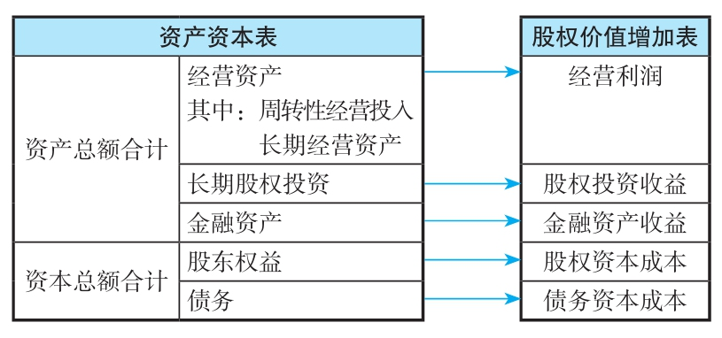

# 财务报表分析与股票估值

| 状态 | 已归档   |
| -- | ----- |
| 分类 | 投资,会计 |
| 作者 | 郭永清   |

- 我们需要重点清洗资产负债表和利润表数据，以提高后续财务指标分析的准确程度。
- 对于具备太多会计灵活性的公司，我们一定要谨慎为上。
- 如果其资料看了整个上午都无法理解的公司，最好别碰。业务模式越简单，财务数据越清晰，对投资者开展财报分析来说越有利。
- 潜在的危险信号：
  - 未加解释的会计政策或会计估计的变化；
  - 引起销售增长的应收账款及库存非正常增长；
  - 企业销售收入与营业现金流及税务收支之间的差距扩大；
  - 未预计到的大量资产注销；
  - 年度报告相对于中期报告的大量调整；
  - 缺少市场客观判断的关联交易；
  - 高管人员的频繁更换；
  - 大股东或者高管人员不断减持公司的股票；
  - 频繁的资产重组和剥离、股权转让。
- 公司所处的行业将在很大程度上决定公司财报的结构特征以及盈利水平。
- 如果一个公司能够成功地实施总成本领先策略，其财报的特征为：相较于同行而言高速的资产周转率、更低的成本费用率，最后取得较高的销售净利率。
- 对于一个采用差异化策略的公司，我们可以用毛利率的高低来衡量其策略执行是否成功。一般来说，差异化策略的公司毛利率应当长期高于 30%。
- 通过战略投资活动现金流量，我们可以判断一家公司是出于扩张战略、收缩战略还是维持战略，并预测其现金需求。
- 对于上市公司发行股份购买资产，按照规定要发布发行股份购买资产公告。我们根据公告进行分析时，要关注资产的定是否合理，资产的未来收益情况如何，等等。
- 在财务分析中，我们可以根据一家公司的利息支出和平均债务余额来计算分析其债务资本成本。
- 通过筹资活动用了短期债务资本来满足长期战略性投资的资金需求，导致：一是资本债务率连续上升；二是存在着资本期限和投资回收期不匹配导致资本结构和资产结构错误的风险。
- 当一家公司的筹资活动符合融资优序理论（内部筹资和长期债务筹资）时，该公司即步入了良性发展的阶段。
- 为了分析和后续估值，我们重构了财务报表，资产不再按照流动性分类，而是按照带来经济利益的方式分类，分为金融资产、经营资产（含周转性经营投入和长期经营资产）、长期股权投资三类；资本按其来源和期限分为股东权益和债务，如图：

- 周转性经营投入是指公司在生产经营活动过程中需要投入的营运资产（存货、应收款项、预付款项等）扣减生产经营活动过程中形成的营运负债（应付款项、应付税费、预收款项等）后的净额。
- 对于非金融公司来说，金融资产往往属于低收益资产，在整体结构中占比不宜过高。
- 如果周转性经营投入占比很高，那么营业成本中原材料、人工成本等变动成本所占的比重较高；如果长期经营资产占比很高，那么营业成本中折旧摊销等固定成本所占的比重较高。
- 重资产公司的经营杠杆系数比较高，所以对销售规模的增长要求非常高，销售规模略有下滑，将引起重资产公司净利润的更大幅度下滑。
- 有一些公司欠付供应商的贷款是由于公司出现了支付危机，而不是由于公司管理效率的提升。
- 如果长期融资净值（长期融资净值 = 长期债务 + 股东权益 - 长期经营资产  长期股权投资 - 长期周转性经营投入）为负，则说明公司存在将短期资本用户长期资产的现象，即我们通常说的「短融长投」，就是激进型资本结构。
- 利润表缺陷：无法知晓哪些收入和利润是哪些资产产生的；没有考虑股权资本成本；利润表内部存在混乱（未考虑综合收益与所得税费用之间的关系）
- 重构后的利润表：

- 我们认为，财务费用与公司筹资活动关系更加密切，而与公司经营活动关系不大，因此把财务费用放到息税前利润后面座位资本成本来分析。
- 营业费用分析的重点在于，花出去的钱是否赚回来更多的收入，因此需要把费用跟收入进行比较——费用率是否稳定或有所下降。
- 对于投资者而言，如果上市公司投资了很多被投资单位的话，分析每一家被投资单位的财报不太可能：一是成本太高，二是很多信息无法得到，因此，多数时候仅仅是分析长期股权投资收益总额及其趋势。
- 利润的质量，是指利润的稳定性和持续性。不同来源的利润，其质量存在差异。
- 真实财务费用 = 标准利润表中的财务费用 + 利息收入
- 财务成本负担率 = 真实财务费用 / 息税前利润
- 计算长期经营资产周转率的意义在于，通过分析，来判断一家公司的长期经营资产结构是否合理，管理效率是得到了提升还是下降。
- 长期股权投资还需要结合公司的战略安排来分析，有时候是为了保证公司下游供应商和下游渠道的稳定，则此时的收益回报并非决定性因素。
- 公司持有金融资产的目的是应付经营活动的现金需求以及防范资金危机和投资性需求，但对于非金融公司来说，不应该大量持有金融资产，一般占公司资产总额的 5% \~10% 为宜。

