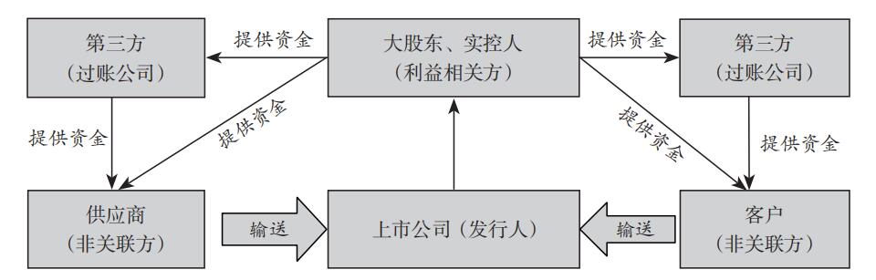

# 财务诡计：如何识别财务报告中的会计诡计和舞弊

| 状态 | 已归档       |
| -- | --------- |
| 分类 | 投资,会计     |
| 作者 | 霍华德·M·施利特 |

- 推荐序
  - 我们在对上市公司进行财务分析时，一定要透过现象看本质，不但要看上市公司的报表，还要看利益相关方的报表。
  
  - A 股没有白马股的控股股东报表上也存在巨额的资金挂账，通常挂在「预付款项」「其他应收款」「长期股权投资」或「可供出售金融资产」账下。
  - 作者总结了上市公司不断并购的三个驱动因素：一是对神奇的「协同效应」的过渡自信；二是极度恐惧或者贪婪驱动下的不停交易；三是被虚假会计和报告盈余驱动的交易，而不是立足商业逻辑。
  - 随着业务越来越复杂，会计处理也越来越复杂，有可能会通过交易设计和组织安排达到「真实但不公允」目标。
  - 投资者同样要学会在两个层面进行财务排毒。(1) 业务排毒。我们应对激进的商业模式保持警惕，对违规的商业模式保持警惕。(2) 会计排毒。首先判断企业主要会计政策及会计估计是否谨慎。
  - 利润表分析强调「一个中心，两个基本点」，即以「收入质量」为中心，「毛利率」和「费用率」为两个基本点。
  - 如今一些上市公司玩「文字 + 数字」游戏，在业务上将工业、商业、服务业等不同行业属性的业务打包在一起，然后称「XXX整体解决方案提供商」，披露「毛利率」时不分行业披露，将高毛利业务和低毛利业务混在一起，企图浑水摸鱼，掩盖「毛利率」畸高的问题。
  - 负债分析另一个要强调的事项是「久期」计算。久期一直是一个固定收益的概念。笔者认为权益投资分析者财务分析失败，很大程度在于没有站在负债的角度分析报表：企业投资价值再高，一旦信用违约，股权价值就此可能清零。
- 警惕那些管理层之间缺乏核查和制衡关系的公司（比如家庭成员和朋友占据高管职位的组织结构更容易产生财务诡计）。
- 小心那些为达目的不择手段的高管，比如设定一个过高的销售数据目标。
- 对那些自吹自擂、王婆卖瓜型的管理者保持怀疑（在公开场合吹嘘自己总是能达到或者超过市场预期的高管）。
- 我们可以总结出一下经验教训：过犹不及。是的，基于业绩的薪酬计划往往被人们认为是一件好事，但是在设计的时候一定要使用合乎情理的指标，并且该计划一定是适度风险导向的。
- 警惕那些延长季末报告的公司。冠群电脑出于记账需要将每个月延长至 35 天，以便将随后几天的收入归入当月。
- 警惕靠变更收入确认的会计政策来隐瞒业务崩溃的事实。
- 警惕确认收入过早的情况，比如：(1) 客户收到的货物有误；(2) 客户收到的货物正确，但是收到的太早了；(3) 客户在恰当时间收到了正确的货物，但是仍然保留了取消交易的权力。
- 有时公司为了虚增收入，会故意将错误的产品发送给客户并确认相关收入，但事实上他们心里非常清楚产品是一定会被退回的。
- 当公司披露新的延期付款信用政策并且应收账款周转天数骤然增加时，警钟就敲响了。
- 双方签订了一份名为保险合同的协议，却并不意味着该协议一定可以列到财务报表中。会计认可的保单必须具备风险从被保险人转移给承保人的实质。（亮点公司将美国国际集团支付“理赔保险”记为收入，而美国国际集团将未来 3 年内从亮点公司收取的“保费“记为收入。本质上是融资交易被伪造成保单）
- 如果公司一分钱都没有收到却在会计上记录了销售收入（如易货交易），投资者要当心这种情形。当这种交易是和关联方客户达成时，投资者的警惕性应提到最高水平。
- 注意供应商退款。向供应商采购货品时，通常情况下现金是沿着一个方向流动的，即从客户流向供应商。有时候，现金会反方向流动，通常表现为一定数量的退款或反例。将这样的现金退款记录为收入显然是不对的，正确的做法是将其记录为购货成本的调整。
- 收入和营业利润增长水平之间的巨大差异应促使聪明的投资者警惕并挖掘背后的真相……这意味着公司要么神不知鬼不觉地计入了一笔大额的一次性利得，要么用了某个诡计来虚增收入或隐藏费用。
- 警惕出售事业部包装成经常性的收入流。或者采用混合交易，比如便宜卖掉事业部，之后可以以更优惠的价格购买产品。
- 警惕将损失转移到终止经营项目下的公司。发一纸公告，宣布将卖掉一个正在赔钱的部门，这个简单的把戏，可以魔法般地提高企业的营业利润。
- 利用资产负债表项目分类的自行决定权虚增营业利润。当子公司的利润强劲时，公司管理层通过声称这一期间内公司对子公司有重大影响力，就可以将子公司的利润搬到自己的利润表上；当合资企业的业绩不佳时，则通过声明自己对合资企业没有重大影响力，从而将亏损从资产负债表上卸除。
- 上市公司在给成本费用记账时，采用了相似的「会计两步舞」。支出发生时跳第一步，这时钱已经花出去了，但是相关利益尚未获得，这些支出代表的是「未来利益」，因此公司的资产负债表上被列为资产；取得利益时跳第二步，这时，支出要从资产负债表移到利润表并被列为成本费用。
- 这种「会计两步舞」的关键在于舞步的节拍，即成本费用应该和长期收益还是短期收益去配比。
- 上市公司可以自主改变「会计两步舞」的节拍，从而显著影响利润数字。勤快的投资者会估量一下是不是在公司跳第一步舞时就故意将成本费用冻结在资产负债表上，而不是接着跳第二步舞，将其体现在利润表上。
- 投资者一旦发现如此大幅的开支增长，就等于触到了史无前例的会计欺诈的苗头，将常规经营费用不当资本化的警报：
  - 利润无忧增长，某些资产激增；
  - 自由现金流意外骤减，同时经营活动现金流量净额增加了差不多的金额；
  - 资本性支出暴增，背离了公司的经营方向，也与市场情况不符。
- 一项新的，或者异常的资产项目（特别是增长迅速的那种），会是不当资本化的标志。
- 如果发现有的支出在资产负债表的长期资产项下挂账太久，比如具有不同寻常的超长摊销周期，投资者应予以关注，如果是公司管理层决定拉长摊销周期，这就更是特大警报信号了。
- 公司预料市场需求上升，销售快速增长，就会战略性备货。这的确是个完美正当的商业战略，公司经常将其作为惯用借口来论证突发的存货增长是多么合理。若是公司以此理由解释存货增长，投资者应判别备货行动是存货增长之前就有的战略，还是在存货增长止呕公司才以此自辨。这种备货战略若未被事先提及，投资者就应对存货增长存疑。
- 还有一个方法可以检测存货的增长是否与未来需求相符：把存货的绝对增量和公司的预期收入增长做简单对比。如果存货增幅远大于预期销售额的增幅，那么多出来的存货极有可能是毫无根据的，投资者应予以关注。
- 如果所有的准备金账户都向着错误的方向移动（即下降），那么，快逃！
- 与不良贷款（借款人拖欠利息或者逾期不还的贷款）相比，贷款损失准备金反常下降更值得质疑。
- 特别注意公司借钱给自己的客户。例如，一家激进的公司若是渴求销售增长，会放宽其贷款期限，以后再关心由此带来的坏账。
- 要经常检查从供应商处获得的可疑现金。正常情况下，现金是向供应商流出，而不是从供应商流入，因此，来自供应商的现金流入非同一般，通常是会计欺诈的标志。
- 切记要检查表外采购承诺。会计准则要求公司管理层在财报的附注中披露大额承诺。尽管不列在资产负债表上，这些支付义务仍需公司履行。不注意这些的投资者，险矣。
- 在前期提取准备金的好处之一就是虚增未来期间的营业利润，因为未来期间的成本费用早就已经被提取入账了。
- 日光公司提取了很多不恰当的充足准备金和其他秘密准备金作为重组计划的一部分。这些不当准备金，后来被转回并释放为利润，虚增了利润总额，使投资者产生了「重组非常成功」的幻觉。
- 投资者应提防与基础资产或负债同向变动的「对冲」，这个信号表示，公司管理层是在用衍生工具做投机，而不是在做对冲。
- 辉达公司核销了其尚未丢弃的存货（并在后来卖掉了它们），玩具反斗城公司提取大笔一次性费用，所有这些，看起来都有相同的后果：将远期费用提前在本期确认，并且讲这些核销的费用置于和正常业务活动无关的非营业利润中。这些行为虚增了未来期间的利润，同时无损于当期的营业利润。
- 在公司为 100 位离职员工发放了合计 250 万美元的补偿金后，剩下的 250 万美元就留在负债之中，却并没有相应的支付义务。就这样，管理层先提取、后释放了负债账户的大笔虚假准备金，从而削减了补偿费用。
- 当管理层用自创的现金流量计量标准来重新计量并强调如此重要的经营活动现金流指标时，投资者应该谨慎对待。
- 准则规定将转让应收撞款收到的现金确认为经营活动现金流入更恰当，而不是确认为筹资活动现金流入（因为收到的现金可以被认为是过去销售的回款。）这是众多甚至会让最理智的投资者都干到模棱两可的灰色地带之一。
- 投资者不应该仅关注经营活动现金流量增加了多少，还要关注它是如何增加的。
- 阅读季度报告所披露事项的变化情况是一件非常值得你花时间去做的事，尤其是阅读报告的重要部分。大部分研究平台和文字处理软件具备「文字对比」或者「突出显示」功能。因此，拿两份报告逐一对比很有效，并没有听上去那么呆板。
- 当转让方（转让应收账款）仍保留部分信用风险（追索权）时，则应将该交易确认为一项借款，将受到的现金确认为融资性现金流入，而不影响经营性现金流量。
- 如果你怀疑一家公司通过不合理资本化虚增利润，不要忘记经营活动现金流量也可能被夸大。
- 「柔性」资产科目（如「预付费用」「其他资产」）的快速增加可能预示着激进的资本化行为。
- 拜维尔公司通过非现金交易购买了一些药物的所有权。交易时，拜维尔并没有支付现金，而是向买方发行了一项权证——实质上是一笔长期借款。由于交易时并没有发生现金流动，因此也就不会影响现金流量表。随着拜维尔定期偿还借款，现金支付在现金流量表中被确认为债务偿还，即一项筹资性现金流出……当投资者分析拜维尔创造现金流能力的时候，这类购买支出当然不应该被忽视。
- 寻找「补充现金流量信息」公司通过将非现金交易信息披露在「补充现金流量信息」中。此披露有时紧跟在现金流量表之后，然后，有时候公司会将此披露深埋在附注中。
- 应付账款周转率的提高告诉你公司有可能延迟支付供应商的贷款。投资者可以评估一下因延迟支付供应商贷款而增加的经营活动现金流量有多少，这部分增加的金额是不可持续的，并且与业务活动增长无关。
- 当公司利用应付账款「融资」时保持警惕。在这些所谓的供应商融资安排当中，公司并不直接向其供应商支付贷款，而是由银行先支付贷款给供应商，然后公司在一段时间后再讲贷款偿还给银行……由于偿还银行借款在现金流量表中被列报为一项筹资活动，所以导致采购支出永远不会被列报为一项经营活动现金流出。
- 地方经营活动现金流量的显著增加。当管理层说这是因为「激进的营运资本管理」所致的，许多投资者觉得这是好事，但其实你应当将其作为一个警示信号，即最近的经营活动现金流量可能是不可持续的。
- 投资者应该阅读同行业其他公司的财务报告，不仅要比较业绩和财务状况指标，还要评估会计准则的使用和披露。记得问两个重要的问题：
  - 评估公司业绩的最佳指标是什么？管理层是否强调、忽略、歪曲，甚至自定义这些指标？
  - 能够揭示公司财务状况正在恶化的最佳指标是什么？管理层是否强调、忽略、歪曲，甚至自定义这些指标。
- 当在同类群组中比较关键的非公认会计准则指标时，保持这些指标计算口径的一致性非常重要。
- 当投资者看到应收账款周转天数快速降低（尤其是应收账款周转天数快速提高之后又快速降低）时，与看到该指标显著提高时一样，都应该保持同等警惕。
- 如果某家公司改变了其应收账款周转天数的计算方法从而掩盖其业绩恶化的事实，投资者应该对其尤为警惕。泰乐公司使用期末应收账款余额计算应收账款周转天数，但又改成使用季度平均应收账款项余额。
- 作为投资者，当看到一家公司公开与其审计师产生分歧的时候，你应该感到担忧，尤其是针对金额巨大的灰色交易。
- 在并购交易快要结束的时候，管理层可以制造很多机会为未来的虚增利润留出空间。管理层可以确认大量的裁员或者可能得法律支出相关费用，并在随后期间转回这些准备金的一部分，声称相关费用远没有预期那么高。
- 当你进行并购的时候，很显然必须为购买的存货、应收账款等项目付账，但是这些项目的现金流出被记录在投资活动现金流出里。当并购结束后，你喜滋滋地从客户那里收到钱，并将其记录为经营活动现金流入……在并购的情境下，现金流出完全不用计入经营活动，而现金流入统统被计入经营活动。
- 「并购后的自由现金流量」是衡量并购主导型公司现金流质量的十分有用的指标。这一指标可以根据现金流量表上的数字简单计算得到：经营活动现金流量净额减去资本性支出，再减去并购支付的现金。
- 太尼特保健公司总是玩一个小小的提升经营活动现金流量的技巧——出售所有业务，除了应收账款。
- 如果被分析的公司当期发生过重大并购，我们建议您仔细阅读年报中的每一条信息，仔细琢磨披露的数字，来对并购公司原有业务、被并业务和集团整体业务的增长情况有一个清晰的判断。
- 谨慎的投资者考虑到往往初步的调整报表最后都被证明是错误的，而且实际上情况往往会比初步调整报表描述的更加糟糕。
- 公司会选择将一些必须披露但是不那么好看的信息深藏在要求披露的文件的最后面，很少有读者会发现这些坏消息。基于这样的原因，我们在阅读这些文件的时候总是会完整地阅读，而且我们总是把怀疑的触角伸向那些对于大多数读者来说显得过于偏重技术描述或者无聊的部分。
