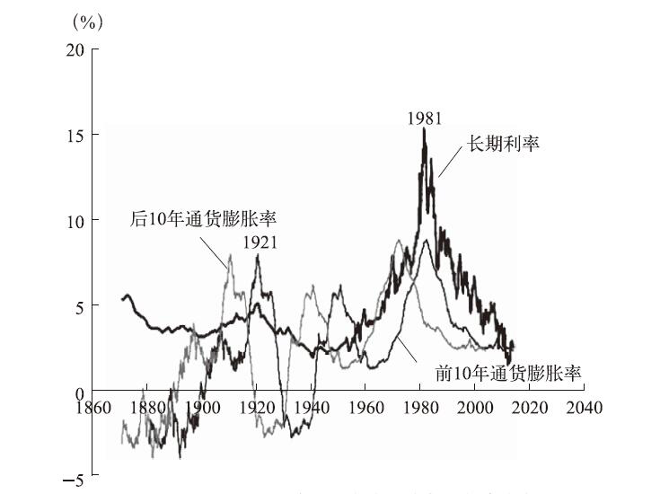

# 非理性繁荣（第三版）

| 状态 | 已归档      |
| -- | -------- |
| 分类 | 金融,投资    |
| 作者 | 罗伯特·J·席勒 |

- 相比之下，长期利率更具投机性、更难以驾驭。这是因为，同股票市场一样，公众对长期债券的需求取决于他们对未来前景的预期和比较，而决定市场未来前景的因素，时至今日中央银行仍无法控制。
- 通过观察可以发现，利率和市盈率之间并没有呈现强相关关系。在大萧条时期，利率异常低，按照美联储模型，在此期间相对于盈利，股票市场理应高涨。事实却并非如此。
- 容易看出，在大多数时间特别是最近半个世纪里，利率与前 10 年长期通胀率存在着正向同步关系。然而，从图中亦可以看出，长期利率和「未来」长期通胀（后 10 年长期通胀率）之间几乎没有关系。（投资者欲保护购买的债券不受通胀侵蚀，未来的通胀对其更重要）

- 千禧繁荣前夕，公众对通货膨胀的认识误区推高了人们对（通胀调整后）实际回报率的预期。媒体大多使用名义数据，并没有修正通货膨胀的影响，这很自然地让人们相信这汇总回报率在将来会持续下去。
- 价格曝光频率越高，人们对股票的关注越多，人们对股票的需求也越多。
- 任何大盘股的失败都曾发生在市盈率接近 100 的时候。
- 金融繁荣或萧条并不像战斗胜利或火山爆发那样煽情。事实上，在最重大的金融事件发生时，多数人都在忙于个人事物而无暇顾及。因此，很难想象市场作为一个整体会反映出心理学理论所描述的情绪。
- 锚定效应可能可以解释为什么不同的股票会一起涨跌；涨跌与总部位置的相关性会高于行业；房地产信托投资基金表现得更像股票而不是房地产。金融市场出现的许多异常现象实际上都是由于人们倾向于把便于参考的数字作为数字锚。
- 这种投资于本企业股票的趋势与投资者受到故事的影响是一致的：他们了解更多的是本公司的故事，因此投资于本企业的股票。
- 传染病模型仍有助于理解那些导致股票市场价格变动的因素。例如，疾病传染率或退出率的任何变化都会改变新信息的传播率。举例来说，一则未涉及金融市场的全国范围的新闻可以分散对金融市场的注意力，从而降低与投机市场相关的信息传播率。
- 大部分进行日内回转交易活动的投资者在交易当天甚至没有从他们的交易中赚足够的钱来抵消他们的交易成本。

